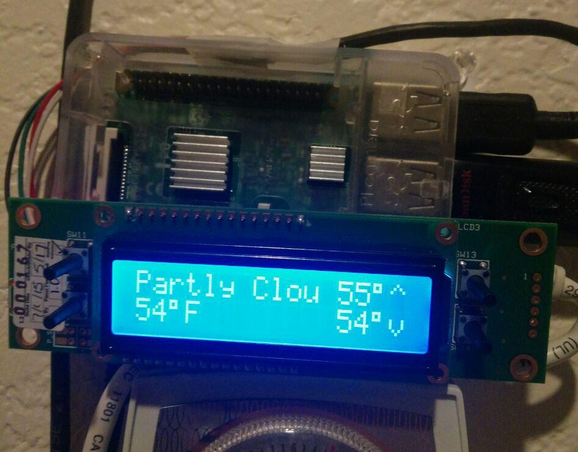

# Welcome to my example markdown file. (Top level heading/H1)

## This is a second-level heading.

## These are also called H2 headings.

1. This is a numbered list.
2. These are great for numbering items.
3. Use these when order matters.

- These are bulleted lists.
- They're great for unordered things

This is my home weather display.

This is a photo of me.

[This is a link to my personal website](https://mtburnes.dev/)

[This is a link to my GitHub page](https://github.com/mtburnes/)

[This is a link to my LinkedIn page](https://www.linkedin.com/in/mtburnes/)
